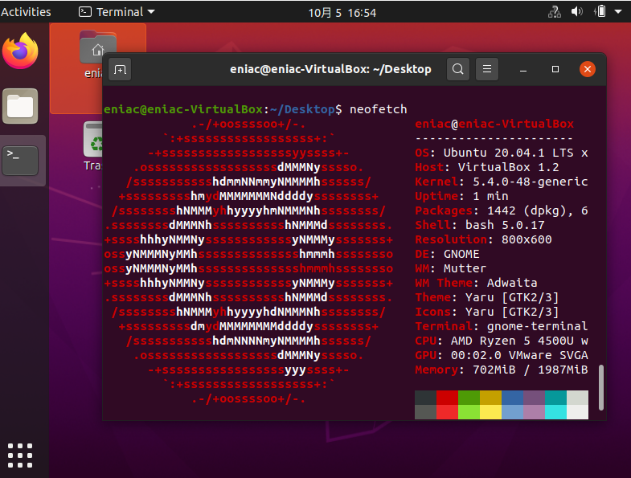
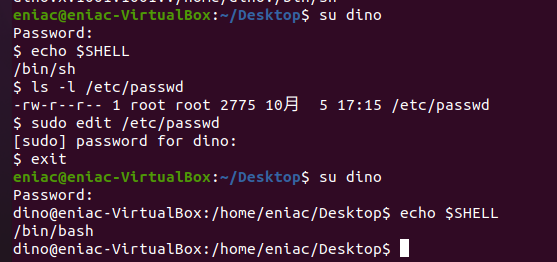
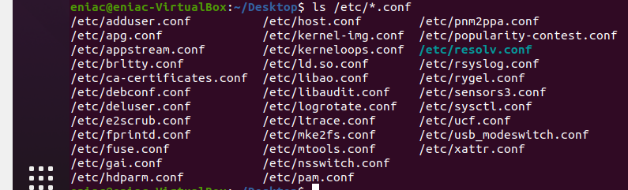

# Part 1
## 1-1
**为什么操作系统以 C 编写的话，可移植性会比较高呢？**

操作系统底层运行着机器语言，而汇编语言可以直接翻译成相应的机器语言，因此最初也有用汇编语言写操作系统的。而后来开发的C语言能够编译成汇编代码，减少汇编的工作量，它能编译成不依赖操作系统的二进制代码，包含了许多脱离系统的库。每一种CPU支持的指令集都不一样，例如x86指令集和arm指令集，但是C语言拥有这些指令集的编译器，一份相同的代码，可以被编译成不同的指令集所对应的汇编代码，从而能够实现功能。每个操作系统都是运行在特定的硬件CPU上的，只要能够编译成所支持的机器代码，就能运行操作系统，因此C语言，由于其相对底层的特性以及编译器的支持，它具有较高的可移植性。

## 1-2
**​依上文所叙述的特色，比较 Unix 与你熟悉的操作系统（如：Windows ）有哪些相同或不同之处？**

- Unix是以纯文本的方式存取数据，而Windows中，有很多数据都是以二进制的形式保存的，例如office系列的docs和xlsx文档。
- Unix和Windows一样都有一大堆的程序，Windows的内核主要是用C编写的
- Unix和Windows一样都可以让程序一起运行，可以处理文本，但是Windows能够让程序运行在多个线程上，同时完成多个任务
- Windows的程序通信有多种方法，如动态连接库、Sockets等方法

## 1-3
**你支持 Unix 哲学吗？你认为这套理论在目前程序开发上是否还适用？并说明你的理由。**

不完全支持。
- 随着硬件技术的进步，多核多进程的硬件相继问世，在某些计算要求高的领域，让程序仅完成一件事还不够，需要让它能够同时执行多个任务更可能是未来发展的趋势。
- 程序能一起使用，这一点在许多操作系统上都支持，主要是依赖于操作系统的并发功能。
- 大部分的程序不仅仅处理文本，而且能够解析主流的二进制格式，例如pdf和jpg。随着科技的进步，继续采用这种纯文本并不合适，纯文本会占用较多的空间并且在解码上也可能不如二进制数据，而二进制的方式更加节省存储空间。

## 1-4
**迅猛龙同学基于开源软件------ Dino Dash 开发出了 Dino Dash 2 ，发布后但他忘了在里面附上许可证，结果违反了原软件许可证的规定，请问源软件可能是在哪些许可证下发布的？（ 选项：GPL/MIT/APACHE/BSD ）**

MIT, APACHE

## 1-5
**分享你用过的一款开源软件及说明它的许可证（如果你觉得你没有用过开源软件，Your browser may be a good place to start. ）。**

[tensorflow](https://github.com/tensorflow/tensorflow)

[tensroflow license](https://github.com/tensorflow/tensorflow/blob/master/LICENSE)

## 1-6
<!--  -->

**迅猛龙同学在网上发现了一张合照，但他谁也不认识，请你尽可能帮助他辨识里面的人物或动物吧！**

Linux, docker, MySQL, MariaDB, Python, PHP, Firefox

## 1-7
**综合以上阅读及你对操作系统的理解，你觉得Linux到底能不能算是一个“操作系统”？说明你的理由。**
不算。Linux只是操作系统的内核，一个完整的操作系统除了内核之外，还应该包括启动程序 (Bootloader)、init 程序、库 (libraries)、基本的 Unix 指令、包管理器和其他命令行(CLI)/ 图形 (GUI) 程序，只有这样才能作为一个完整的系统去完成需要做的事情，只有内核还远远不够。

## 1-8
**请查阅相关资料，了解什么是虚拟机，并简要说明你的理解。**
虚拟机是一种虚拟化技术，通过模拟完整的硬件系统，来实现一个完全隔离环境中的操作系统，能够完成大部分真实系统中所需要的功能。

**请你安装虚拟机，并在虚拟机中安装 Ubuntu，相信聪明的你一定能够完成的。**
安装了Virtual Box 6.1.14和Ubuntu 20.04

**安装完系统后，打开终端 (Terminal ，找找你系统中的应用) ，安装并运行 neofetch 后，截一张图作为本题答案。**




# Part 2
## 2-1
**定义一个变量 `MY_VALUE=233 `，并查看它的值。在终端中输入`sh` （这个命令的意思是执行当前用户的 Shell），再次查看 `MY_VALUE `的值，两者的值还一样吗？为什么？**

不一样，后者输出的是空值。因为输入`sh`的时候，相当于进入了一个新的shell进程，而`MY_VALUE`的作用域只限于先前的shell进程。

## 2-2
**承上题，如果我想让两者的值一样呢？有什么其他命令可以定义MY_VALUE ？说明你的方法，并指出由它定义的变量作用范围。**

方法：
```sh
export MY_VALUE=233
```
`export`将自定义变量注册为系统环境变量，作用域仅限于该次登陆操作

## 2-3
[file here](uploads/2-3.bashrc)


## 2-4
```
sudo useradd dino
sudo passwd dino
ls -l /etc/sudoers
sudo chmod u+w /etc/sudoers
sudo edit /etc/sudoers
# add   dino    ALL=(ALL:ALL) ALL
sudo chmod u-w /etc/sudoers
su dino
```

## 2-5
- 第一列为用户名称
- 第二列为密码占位符，x表示该用户需要密码才能登录，否则无须密码即可登录
- 第三列为用户ID（UID）
```
UID是一个 0~65535 之间的数，不同范围的数字表示不同的用户身份
0：超级用户
1~499系统用户
500~65535：普通用户
```
- 第四列为用户组ID（GID）

- 第五列为用户附加基本信息，一般存储用户名全称，联系方式等信息
- 第六列为用户的$HOME目录位置
- 第七列为用户登录的Shell，/bin/bash为可登录系统Shell，/usr/sbin/nologin表示用户无法登录系统。



## 2-6
xterm是X terminal emulator，是一个X Window System上的终端模拟器，用来提供多个独立的SHELL输入输出。

依赖包包括：
- libc6 (>= 2.15) [amd64, s390x]  
GNU C Library: Shared libraries
同时作为一个虚包由这些包填实: libc6-udeb  
  libc6 (>= 2.17) [arm64, ppc64el]  
  libc6 (>= 2.28) [armhf, i386]
- libfontconfig1 (>= 2.12.6)  
generic font configuration library - runtime
- libfreetype6 (>= 2.2.1)  
FreeType 2 font engine, shared library files
- libice6 (>= 1:1.0.0)  
X11 Inter-Client Exchange library
- libtinfo6 (>= 6)  
shared low-level terminfo library for terminal handling
- libutempter0 (>= 1.1.5)  
privileged helper for utmp/wtmp updates (runtime)
- libx11-6  
X11 client-side library
- libxaw7  
X11 Athena Widget library
- libxext6  
X11 miscellaneous extension library
- libxft2 (>> 2.1.1)  
FreeType-based font drawing library for X
- libxinerama1  
X11 Xinerama extension library
- libxmu6  
X11 miscellaneous utility library
- libxpm4  
X11 pixmap library
- libxt6  
X11 toolkit intrinsics library
- xbitmaps  
Base X bitmaps

推荐：  
- x11-utils    
X11 utilities

建议：  
- xfonts-cyrillic  
Cyrillic fonts for X

## 2-7
1. 有非开源软件
2. 
- Main  
Main 库由 Ubuntu 官方支持，其中的软件都是开源免费的。Ubuntu 的默认安装中的所有开源软件都在 main 库中，另外还有一些比较重要的服务器软件也被包含在 main 库中。在 Ubuntu 发行版的生命周期中，main 库中的软件会有安全更新，严重的问题会被修复。  
**eg**：vim

- Universe  
Universe 库中存放的是由社区维护的开源软件。
**eg**：l2tpd

- Multiverse  
Multiverse 库是不受 ubuntu 官方支持的软件、闭源软件和专利授权软件聚集的地方。这是有争议的东西存在的地方。它包括像 Adobe Flash 插件这样的闭源软件，和那些依赖于闭源软件的包，比如 Skype 的插件。它还包括受法律限制的开源软件，例如侵犯专利的音频和视频播放软件。
**eg**: kplayer

- Restricted  
Restricted 库中包含 Ubuntu 官方支持的闭源软件(Closed-Source)，主要是一些硬件驱动程序。比如运行一些游戏程序，需要安装 NVIDIA 或 AMD 的图形驱动程序来获得最佳的图形硬件性能。这些驱动程序可以通过 Ubuntu 中的其他驱动管理工具来启用。
**eg**：AMD驱动

- Partner  
Partner库包含了Canonical的合作伙伴专有的软件（如Skype，VMWare客户端，Adobe公司的Flash，Adobe Reader等）（都是免费提供的软件）。
**eg**：Skype

## 2-8
```
cd ../ ... /.. # n个`../`
```

## 2-9
```
ls -ad .*
```

## 2-10
直接匹配.conf后缀的文件
```
ls /etc/*.conf
```



## 2-11
- c  
字符设备，是一些串行端口的接口设备，例如键盘、鼠标、打印机、tty终端。
- b	  
块设备，是一些提供系统存取数据的接口设备，例如硬盘
- d  
目录
- l  
链接

## 2-12
- u 表示该文件的拥有者，g 表示与该文件的拥有者属于同一个群体(group)者，o 表示其他以外的人，a 表示这三者皆是

- `+` 表示增加权限、`-` 表示取消权限、`=` 表示唯一设定权限。

- r 表示可读取，w 表示可写入，x 表示可执行，X 表示只有当该文件是个子目录或者该文件已经被设定过为可执行。


